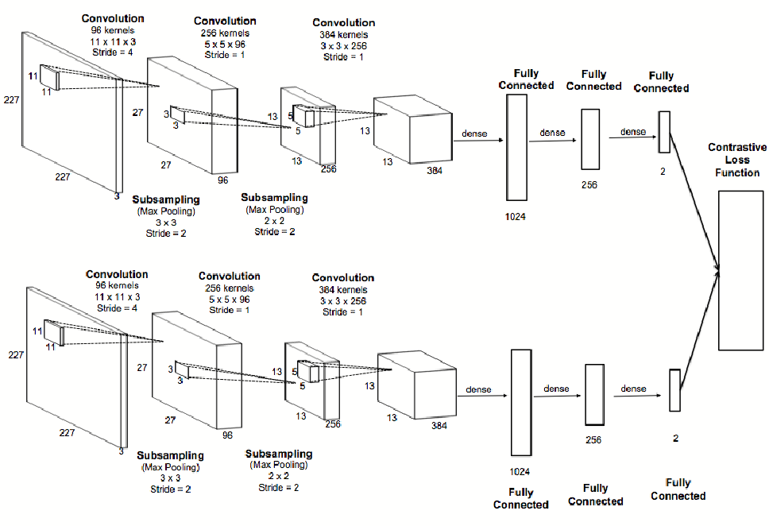

# Siamese Network
The siamese networks were introduce in the early 90's by Bromley et Al.[1]. A siamese neural network consists of twin networks which accept distinct inputs but are joined by an energy function at the top. This function computes some metric between the highest-level feature representation on each side[2] which computes the **similarity** between the inputs instead of classify the inputs as a regular neural network.

The follow image shows an example of the architecture of a siamese Network.



For this project the network will verify similarities between faces inside the dataset and an external source (photo, webcam, etc).

# Implementation

In order to have an optimal implementation of this kind of network, we will consider the siamese network as two Networks instead of one: one that will be the ***feature extractor*** and a full connected layer at the end which will ***compute the similarity*** between both inputs.

## Feature extractor

Since the first part of the network is to extract the features of the inputs, we can use ***transfer learning*** and use an existent architecture(such as ResNet, Inception, etc.) that have shown good result in classification tasks and therefore their intermediate layers are good feature extractors.

For this implementation we will use the ResNet50 architecture trained for imagenet and we will get the output of the layer ***activation_46*** which has an output of 7x7x2048 followed of an ***Global Average Pooling*** to get a feature vector of 2048 (you can modify this architecture in the code).

Finally instead of compute the feature vector every time we want to get the similarity between one input image and one image from our dataset, we will compute once the features of every image in our dataset and save the feature vectors using cPickle for future use.

## Similarity network

The input to the similarity network will be the absolute difference between the feature vectors of the input images (this input can be normalized) and the feed to a network with a final output of 1 unit and a ***Sigmoid*** activation.

# How to use

1. Run the script as 
```bash
python network.py --output path/to/save/model --model model_name --print_model 0
``` 
1.1. You can modify the input size of the image on line 26
```python
resnet = ResNet50(weights='imagenet', input_tensor=Input((224, 224, 3)))
```
1.2. If you wish, you can modify the layer to use as feature vector by modifying the line 28 and if you wish removing the **Gobal Average Pooling**.
```python
x = resnet.get_layer('activation_46').output
# Get only one dimmension
x = GlobalAveragePooling2D()(x)
```

2. Run the script to extract the features from the dataset (one directory per person's face)
```bash
python extract_features.py --faces_path path/to/dataset --model_path path/to/model --features path/output/features/directory
``` 

3. (Optional) Compute the mean and standard deviation of the dataset to normalize the data before the training:
```bash
python compute_mean.py --features_path path/to/features/directory
``` 

4.
```bash
python train.py --features_path path/to/features/directory --output_model directory/similarity/network/ --epochs 15 --normaliza 0
``` 

4.1 For the training we will compare each face with the others in the dataset, for negative examples you will only take 1.5 times the number of positive examples as negative examples you can modify this value on line 88.
```python
	   nidxs = np.random.randint(neg_list.shape[0], size=int(face1.shape[0] * 1.5))
```
4.2 You can modify the architecture of the similarity network in the function ***create_model*** on line 10.
```python
# Create a model for the siameses network, modified with your own architecture if necessary
def create_model(inputs=(2048,)):
	xin = Input(inputs)
	
	x = Dense(512)(xin)
	
	x = Dropout(0.5)(x)
	
	x = Dense(256)(x)
	
	x = Dropout(0.3)(x)
	
	x = Dense(32)(x)
	
	x = Dense(1)(x)
	x = Activation('sigmoid')(x)
    return Model(inputs=xin, outputs=x)
```
5. Test the algorithm using a webcam in realtime.
```bash
python test.py --features path/to/stored/features/directory --model path/to/resnet/custom/model --classification path/to/classification/model --normalize 0 
```

## Optional

1. In case you don't have any face in your dataset you can create your own set of images using a directory of "selfies" or your own webcam. Please consider that every photo or frame must have only one face.
2. To get the face set from the webcam or video run the algorithm.
Webcam:
```bash
python capture.py --output directory/to/save/faces 
```
Video
```bash
python capture.py --output directory/to/save/faces --video_path path/to/video
```
3. To get the faces from a directory of selfies you can use the algorithm.
```bash
python selfies2face.py --face_selfies path/to/directory/of/selfies --faces_path directory/to/save/faces
```

# References

[1] Bromley, Jane, Bentz, James W, Bottou, Leon, Guyon, Isabelle, LeCun, Yann, Moore, Cliff, Sackinger, Eduard, and Shah, Roopak.  Signature verification using asiamese time delay neural network. *International Journal of Pattern Recognition and Artificial Intelligence*, 7(04):669–688, 1993.
[2] Koch, G., Zemel, R., Salakhutdinov, R. Siamese neural networks for one-shot image recognition. *ICML 2015 Deep Learning Workshop* (2015).
